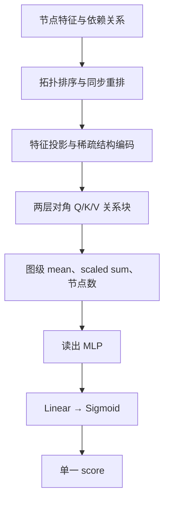

# 单一归一化 score：第一版

一个任务训练一个图元模型。元模型输入架构图，只输出一个 0～1 的分数。
拓扑排序、稀疏依赖编码、两层对角 Q/K/V 关系块和图级池化沿用 V2.1。
移除 completion 输出和 BCE；不再对 score 做训练集均值、标准差变换。

## 标签

每次任务训练的分数为：

\[
u_{a,r}=\begin{cases}
\dfrac{L_0+\epsilon}{L_0+L_{a,r}+2\epsilon},&\text{训练完成},\\
0,&\text{训练失败},
\end{cases}\qquad \epsilon=10^{-8}.
\]

其中，\(a\) 是架构，\(r\) 是训练种子；\(L_{a,r}\) 是该次任务训练的最佳验证 NMSE，
\(L_0\) 是相同任务验证集上的固定零预测 NMSE。失败包括已记录的数值发散或运行错误；
尚未完成、缺失、未知状态以及损坏的完成记录不能当作失败标签。

架构标签是全部预定训练种子的平均值：

\[
u_a=\frac1R\sum_{r=1}^R u_{a,r}.
\]

这里的分母包括失败种子。两次分数为 0.9 和 0 时，架构标签为 0.45。
必须从逐种子记录重新计算，不能对旧的平均 log-score 做一次 Sigmoid。
旧标签只保留成功种子的平均 log-score，无法无损恢复新的平均分数。

数据行只有：

```json
{"name": "architecture_id", "score": 0.45}
```

失败架构也具有有效的 score=0；不使用 None、completion 标签或 score mask。
原始任务 NMSE 和运行状态仍保存在实验记录中，用于检查和最终任务评测。

## 网络与损失



\[
\widehat u_a=\operatorname{sigmoid}(w^\top h_a+b),\qquad
\mathcal L=\frac1B\sum_{a=1}^B\operatorname{Huber}_{\delta=1}(\widehat u_a-u_a).
\]

\(h_a\) 为图级读出向量，\(B\) 为 batch 中的架构数。全部架构参与同一项损失。
预测与标签都在 0～1 内，因此这版 Huber 等于半个 MSE；不再存在大误差线性段带来的额外效果。
验证和 epoch 末训练指标使用各自完整划分的平均损失，最佳 checkpoint 按验证损失选择。
AdamW 的学习率 0.001、weight decay 0.01、梯度裁剪 1 保持原设置，本次不同时增加新的正则化。

候选架构直接按预测 score 降序排列，不再乘训练成功率，也不再做第二次 Sigmoid。
有界 score 会压缩接近零任务误差的差异，这是第一版的取舍；最终任务结果仍报告原始 NMSE。

## 使用

```python
from matrix_dsl.metamodel.structured import StructuredGraphScoreModel

model = StructuredGraphScoreModel(objective="normalized_score")
output = model(batch)
assert set(output) == {"score"}
```

新模式实际不创建 completion 层。`return_relations=True` 仍可导出结构矩阵、每层 QK、
Softmax 关系矩阵和 V 聚合结果。历史代码的默认 `objective="legacy"` 只用于旧实验兼容。

训练与搜索入口为 [experiments/iterative_search](../experiments/iterative_search/README.md)。
检查点与搜索协议使用新的身份标记；旧版本实验目录和权重不能直接恢复到新目标。
可以复用已完成任务训练的逐种子记录，在新的输出目录生成新标签并重新拟合元模型。

实际数据 smoke test：

```bash
PYTHONPATH=src .venv/bin/python -m experiments.iterative_search.smoke_score_only \
  --corpora /path/to/frozen/corpora \
  --splits /path/to/full-data/datasets \
  --output /path/to/new/score-only-smoke --epochs 5
```

该检查复用 Adding / Jena 的架构划分和已测量的任务验证结果，不读取任务测试指标，
不重新训练候选任务模型。短程拟合只验证实现，不证明减少过拟合或改进搜索。
