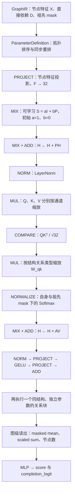

# Mixtensor V2.1：先编码依赖，再学习节点关系

> 本页记录 V2.1 的结构编码与历史双输出读出。当前迭代搜索已改为
> [单一归一化 score](normalized-score-v1.md)：使用 `objective="normalized_score"`，
> 仅输出 Sigmoid score，不含 completion 分支。下面的结构编码和关系块保持适用；
> 双输出、参数量和旧验证记录描述的是 `objective="legacy"`。

实现入口：`src/matrix_dsl/metamodel/structured.py`。复用 V2 的
`diagonal.py` 中的 Q/K/V 通道缩放、关系类型缩放、残差块。图级读出采用无任务 embedding 的单任务版本。

默认配置：节点宽度 32，两个独立参数的关系块，单任务；完整模型 13,578
个参数，去掉稀疏变换的消融模型 13,576 个参数。稀疏结构编码只执行一次。
一个任务一个元模型：Adding 与 Jena 分别训练独立权重，不输入任务 ID。



## 1. 输入与拓扑对齐

省略 batch 维。共有 $N$ 个节点，原始特征维度为 $F$。

- $X\in\mathbb R^{N\times F}$：原语 one-hot、形状、深度、参数信息等。包括 GraphIR 的输入、参数、操作和输出节点。
- $D\in\{0,1\}^{N\times N}$：$D_{ij}=1$ 表示节点 $j$ 直接提供信息给节点 $i$。对角线为零。
- $R\in\mathbb R^{N\times N\times T}$：输入端口/边类型特征；$T$ 是类型数。
- $M\in\{0,1\}^{N\times N}$：允许 QK 交互的位置，即自身及任意可达祖先。
- 还有最短路径距离矩阵和有效节点 mask，用于关系分类与 padding。

ParameterDefinition 使用 Kahn 拓扑排序得到置换矩阵 $\Pi$：

$$
X'=\Pi X,\qquad D'=\Pi D\Pi^\top,\qquad M'=\Pi M\Pi^\top.
$$

端口关系矩阵的前两个轴、距离矩阵的两个轴必须同时重排。
排序后 $D'$ 为严格下三角，但下三角中没有依赖的位置仍为零。
独立分支的排序可以交换，模型不引入依赖节点编号的参数或排序位置 embedding。
保留原有结构深度特征。循环控制流仍是 GraphIR 的控制节点/作用域，不把循环反向边展开为有环图；有环的依赖输入会被拒绝。

`node_order[b,k]` 给出第 b 张图中排序后第 k 个节点的原始下标；
`inverse_order` 用于恢复原始顺序。padding 排在最后。
这里的节点重排语义是按索引 ROUTE，不能和仅交换张量轴的 DSL PERMUTE 混淆。

## 2. 投影与结构编码

$$
H_0=X'W_{\rm in}+b_{\rm in},\qquad
W_{\rm in}\in\mathbb R^{F\times d},\quad H_0\in\mathbb R^{N\times d},\quad d=32.
$$

固定前驱聚合矩阵：

$$
P_{ij}=\frac{D'_{ij}}{\max(1,\sum_k D'_{ik})}.
$$

没有前驱的节点对应全零行。$P$ 不含自身；自身由残差保留，避免重复计入。

可学习稀疏矩阵及传播：

$$
S=aI+bP,\qquad
H_s=SH_0,\qquad
H_{\rm enc}=H_s+PH_s.
$$

- $S,P,I\in\mathbb R^{N\times N}$ 作用在节点轴；$a,b$ 是全图、全节点数共享的两个标量。
- 初始 $a=1,b=0$，所以稀疏步骤初始为单位变换；随后固定聚合已经有效。
- $a,b$ 可以学习为正或负；只有自身和直接前驱位置允许非零。
- 两个传播步骤合起来最多引入两跳依赖；不等于让 S 的两跳位置直接可学习。
- 第一版不按端口类型进一步细分系数，也不开放固定带宽的相邻节点。
- “稀疏”指结构支持；当前小图实现使用稠密 batched tensor，并非稀疏存储加速。

`sparse=False` 固定 $S=I$，仍保留排序、投影、固定 P 聚合、QK 块和读出。
它是检验新增可学习稀疏变换价值的直接对照。原 V2 连固定 P 聚合也没有，属于另一个对照。

## 3. 两层通道缩放关系块

以下结构重复两次，各层参数独立。每层输入 $H\in\mathbb R^{N\times d}$。

$$
Z=\operatorname{LayerNorm}(H),\quad
Q=Z\odot w_q,\quad K=Z\odot w_k,\quad V=Z\odot w_v.
$$

$w_q,w_k,w_v\in\mathbb R^d$ 按节点广播，相当于三个对角矩阵；没有稠密 Q/K/V 投影。

$$
C=\frac{QK^\top}{\sqrt d},\qquad
L_{ij}=C_{ij}\,\gamma_{t(i,j)},\qquad
A_{ij}=\frac{\exp L_{ij}}{\sum_{k:M_{ik}=1}\exp L_{ik}}\quad(M_{ij}=1).
$$

其余位置 $A_{ij}=0$。$C,L,A\in\mathbb R^{N\times N}$。

- $t(i,j)$ 只有三类：自身、直接前驱、其他祖先。
- 每层 $\gamma\in\mathbb R_{>0}^3$，由 softplus 得到，初始全部为 1。
- $W_{qk}$ 是这些共享系数按关系类型展开的矩阵，不是每个节点对独立的参数表。
- 无依赖节点不参与交互；padding 不影响有效节点和图级读出。

更新节点：

$$
\widetilde H=H+AV,
$$

$$
H_{\rm next}=\widetilde H+
\operatorname{Linear}_{2d\rightarrow d}
\left(\operatorname{GELU}\left(\operatorname{Linear}_{d\rightarrow 2d}
(\operatorname{LayerNorm}(\widetilde H))\right)\right).
$$

输入投影和残差 MLP 仍然允许特征通道混合；对角约束仅适用于 Q/K/V。
归一化后的 QK 权重描述消息路由，不能直接解释为对任务 loss 的因果贡献。
另外 Q/K 的缩放只有乘积可辨识，应优先检查 $w_q\odot w_k$。

## 4. 图级输出

有效节点上计算 mean pooling、sum pooling/32，拼接 log(1+N)/5，
得到 65 维图特征（32 + 32 + 1），再经过两层 MLP，得到：

- `score: [B]`：训练时标准化的图级效果分数；反标准化后目标为 log(零预测验证 MSE / 架构验证 MSE)，越大越好。
- `completion_logit: [B]`：独立预测训练成功率，经 sigmoid 得到概率。

任务名称保存在训练配置和实验目录中，不进入神经网络。构造函数不再接受 `tasks`；
`batch_graphs([encoded])` 不生成 task 字段。显式传 task_ids 的旧调用仍兼容历史模型。
含 `task.weight`、81 维读出层的旧 V2.1 checkpoint 不能直接加载到当前模型，需重新训练或单独迁移。

当前不是“每个节点一个 loss 改善贡献分数”的监督模型。

## 5. 代码使用和中间矩阵

```python
from matrix_dsl.metamodel import encode, batch_graphs
from matrix_dsl.metamodel.structured import StructuredGraphScoreModel

encoded = encode(graph_ir, batch_size=256)
batch = batch_graphs([encoded])
model = StructuredGraphScoreModel(width=32, layers=2, sparse=True)
result = model(batch, return_relations=True)

sorted_ids = [encoded.ids[i] for i in result['node_order'][0].tolist()]
S = result['structure']['sparse_matrix']       # [B,N,N]
P = result['structure']['predecessors']        # [B,N,N]
H = result['structure']['after_dependency']    # [B,N,32]
C = result['relations'][0]['similarity']      # [B,N,N]
W = result['relations'][0]['pair_scale']      # [B,N,N]
A = result['relations'][0]['relation']        # [B,N,N]
score = result['score']                       # [B]
```

以上矩阵均按 `sorted_ids` 对齐。权重导出仅开启调试返回，不会 detach 梯度。

## 6. 已验证与尚未验证

单任务读出版本的验证记录见 `reports/relation-v2-1/single-task-smoke.json`。
该检查使用 Adding 的 128 张和 Jena 的 128 张实际架构图，分别检查完整模型和 no-sparse 对照，
共 512 次前向/反向检查。本轮在 CPU 验证；历史 CUDA 记录对应移除任务 embedding 之前的版本。
测试覆盖置换一致性、双轴重排、无关分支、padding、祖先方向、梯度、检查点恢复和循环拒绝。

这些是正确性 smoke tests，不是 V2.1 搜索性能或优于基线的证据。
原 V2 的冻结源码、选择结果和训练协议保存在独立历史归档；完成后的结果见 [benchmark 摘要](../reports/relation-v2/RESULTS.md)。本次结构更新不改写这些历史结果。
